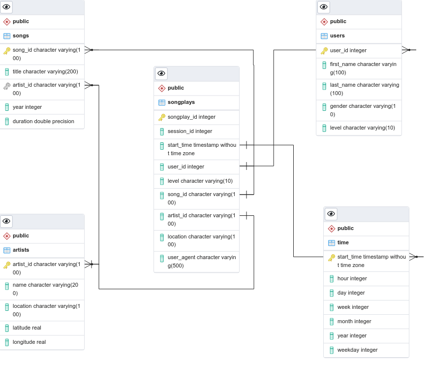

# Sparkify DataBase Creator!
## Data Engineering Nanodegree

The scripts on this folder are used to collect Sparkify's raw data, which are distributed on JSON files, and organized it in a PostgreSQL database for usage by the analytics team inside the company. 

## **1 Installation instructions:**

For installing and running this project you need to have access to a PostgreSQL server either through a local install or a service provider.
In case you want to install a locally, follow instructions on [Official PostgreSQL Web Site](www.posgresql.com). If you are using a service provider you will need to manually exchange the IP address, as discussed below.

To obtain this source and data you can download all files on this GitHub folder or run the command below:

```bash
> git clone https://github.com/aureliobarbosa/nanodataeng-p1.git
```

The most recommended way of executing this project is inside a virtual environment. Below I replicate the instructions for creating a virtual environment on my system (Ubuntu/Linux 20.04 with Python 3.8.10).

*1.1*.  Open the terminal in the project folder and create a virtual environment:

`> python -m venv project_sparkify_db`

*1.2*. Activate the environment:

`> source project_sparkify_db/bin/activate`

*1.3* For leaving the environment run on terminal:

`> deactivate`

*1.4*. For configuring the usage of Jupiter (Notebook and/or  Lab) I recommend following the instructions on this blog post by [Sina Khoshgoftar](https://www.linkedin.com/pulse/how-use-virtual-environment-inside-jupyter-lab-sina-khoshgoftar).

*1.5 Dependencies*

You can install this project dependencies using either

`> pip install -r requirements.txt`

or

`> pip install psycopg2 pandas`

# **2 Running instructions**

*2.1 PostgreSQL* 

Before anything you need a connection to a PostgreSQL. Next, change all calls to `psycopg2.connect` on files `etl.py` and `create_tables.py` including your data, i.e., change:

```python
psycopg2.connect("host=www.xxx.yyy.zzz dbname=database_name user=username password=your_password")
```

considering `www.xxx.yyy.zzz` as the IP address of your database (127.0.0.1, if it is installed in your local machine), and substitute `database_name`, `username`, and `your_password` with your own data.

*2.2 Everything is all set, just run*

To create the necessary tables in the database, run:

`python create_tables.py`

To *Extract, Transform, and Load* the JSON data files into the database run:

`python etl.py`


# **3 JSON files**

Datasets for songs and log from users are stored in the `data` directory. 

Data for songs are stored on a single JSON file for each song inside the `song_data` directory tree. The content of a single file is copied below:

```json
{"num_songs": 1, "artist_id": "AR5KOSW1187FB35FF4", "artist_latitude": 49.80388, "artist_longitude": 15.47491, "artist_location": "Dubai UAE", "artist_name": "Elena", "song_id": "SOZCTXZ12AB0182364", "title": "Setanta matins", "duration": 269.58322, "year": 0}
```

Log data for user are stored in a JSON FILE with information about the songs that users are playing, with one file per events ocurring on each day. On these files JSON are structured on a per line basis, i.e., each line corresponds to a JSON object. An example of data within this file is shown below:

```json
{"artist":null,"auth":"Logged In","firstName":"Walter","gender":"M","itemInSession":0,"lastName":"Frye","length":null,"level":"free","location":"San Francisco-Oakland-Hayward, CA","method":"GET","page":"Home","registration":1540919166796.0,"sessionId":38,"song":null,"status":200,"ts":1541105830796,"userAgent":"\"Mozilla\/5.0 (Macintosh; Intel Mac OS X 10_9_4) AppleWebKit\/537.36 (KHTML, like Gecko) Chrome\/36.0.1985.143 Safari\/537.36\"","userId":"39"}
```

# **4 Database Schema**

The schema of the database generated by the scripts on this project is illustrated below:




